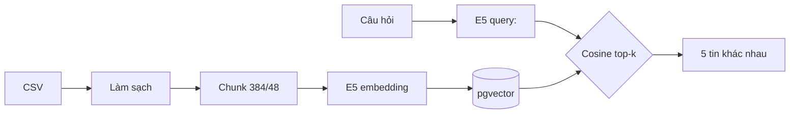
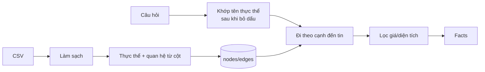
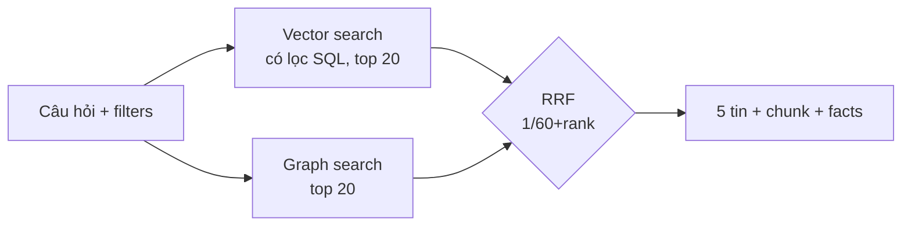
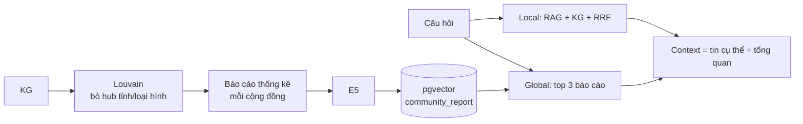

# Vietnam Real Estates — so sánh 4 mô hình truy xuất

Dự án xây dựng và so sánh bốn cách truy xuất tin đăng bất động sản Việt Nam từ câu hỏi tiếng Việt:
**Traditional RAG**, **Traditional KG**, **RAG + KG** và **GraphRAG**. Mỗi mô hình có một notebook
trình bày từng bước, và một **chatbot** chạy cả bốn trên cùng dữ liệu để đối chiếu kết quả.

Các mô hình dừng ở bước **truy xuất + dựng prompt**: chưa gọi LLM để sinh câu trả lời. Chatbot
tổng hợp câu trả lời trực tiếp từ các tin truy xuất được và hiển thị prompt sẵn sàng gửi cho LLM.

## Mục lục

1. [Dữ liệu](#dữ-liệu)
2. [Bốn mô hình](#bốn-mô-hình)
3. [So sánh và khi nào dùng mô hình nào](#so-sánh-và-khi-nào-dùng-mô-hình-nào)
4. [Chatbot](#chatbot)
5. [Cài đặt và chạy](#cài-đặt-và-chạy)
6. [Cấu trúc thư mục](#cấu-trúc-thư-mục)
7. [Kiểm thử](#kiểm-thử)
8. [Giới hạn](#giới-hạn)

## Dữ liệu

Dữ liệu từ [tinixai/vietnam-real-estates trên Hugging Face](https://huggingface.co/datasets/tinixai/vietnam-real-estates)
gồm tin đăng có tiêu đề, mô tả tự do và các cột có cấu trúc: tỉnh, quận,
phường, đường, dự án, loại hình, giá (VND), diện tích (m²), số phòng, hướng nhà, ngày đăng…

Dataset trên Hub hiện dùng các shard **Parquet**. App và cả bốn notebook đọc bằng
`datasets.load_dataset(..., split="train", streaming=True)`. `.env.example` đã đặt sẵn nguồn:

```dotenv
DATA_URL=https://huggingface.co/datasets/tinixai/vietnam-real-estates
```

Cũng có thể đặt `DATA_URL` thành link HTTP(S) tải trực tiếp CSV UTF-8. Với nguồn CSV, trang xem trước/
chia sẻ hoặc trang đăng nhập không dùng được. `DATA_URL` được ưu tiên hơn file cục bộ. Để trống
biến này nếu muốn đọc `data/vietnam-real-estates.csv` có sẵn trên máy. Bản CSV cục bộ khoảng
**3,1 GB**, được loại khỏi Git.

Dữ liệu được đọc theo luồng, không tải toàn bộ dataset xuống máy hoặc nạp toàn bộ vào RAM. Parquet
đọc theo lô/row group nên có thể lấy thêm dữ liệu đệm ngoài số tin mẫu. Notebook
và `app/index.py --limit N` dừng sau số dòng cần dùng. Khi lập chỉ mục toàn bộ qua link, app đọc
một lượt đến hết nguồn, không tải thêm một lượt chỉ để đếm dòng. Chạy lại sau khi bị gián đoạn vẫn
bỏ qua các dòng đã ghi vào PostgreSQL, nhưng phải đọc luồng từ đầu để tìm đến dòng tiếp theo.
Nguồn dữ liệu phải giữ nguyên nội dung và thứ tự dòng khi chạy tiếp; đổi dataset thì dùng `--reset`.

Mọi mô hình làm sạch dữ liệu giống nhau: gộp khoảng trắng, giữ nguyên dấu tiếng Việt, chuyển trường số sang
số (giá trị rỗng/sai/âm thành `None`) và bỏ tin không có cả tiêu đề lẫn mô tả. ID tin là số thứ tự dòng CSV.

Trong 1.000 tin đầu: Hồ Chí Minh 346, Hà Nội 332, Đà Nẵng 56, Bình Dương 53…; loại hình Nhà 484,
Đất 253, Căn hộ chung cư 170, Biệt thự/Nhà liền kề 71, Shophouse 22.

## Bốn mô hình

Mỗi mô hình có hai pha:

- **A. Lập chỉ mục**: chạy một lần khi dữ liệu thay đổi, lưu kết quả vào PostgreSQL.
- **B. Truy vấn**: chạy mỗi khi có câu hỏi.

Các thành phần dùng chung:

| Thành phần | Chi tiết |
| --- | --- |
| Embedding | [`intfloat/multilingual-e5-small`](https://huggingface.co/intfloat/multilingual-e5-small), 384 chiều, chạy CPU. Tiền tố `passage:` cho văn bản lưu, `query:` cho câu hỏi; vector chuẩn hóa để so sánh cosine. |
| Chunk | Tối đa 384 token, chồng lấp 48 token, đếm bằng tokenizer thật của E5. Mỗi chunk lặp lại header (tiêu đề, địa chỉ, loại hình, giá, diện tích) để đủ ngữ cảnh khi đứng riêng. |
| Vector store | PostgreSQL 17 + [pgvector](https://github.com/pgvector/pgvector), bảng `notebook_vectors_384`, tìm cosine chính xác (chưa dùng HNSW). |
| Graph store | Bảng `notebook_nodes` / `notebook_edges` trong PostgreSQL, duyệt bằng NetworkX trong RAM. |
| Collection | Mã băm của dữ liệu + cấu hình. Chạy lại với cùng dữ liệu thì upsert vào cùng chỗ, không nhân bản. |

### 1. Traditional RAG — tìm theo ngữ nghĩa

[Notebook](model/TraditionalRAG/traditional_rag.ipynb)



**Cách hoạt động.** Văn bản tin đăng được chia thành chunk và biến thành vector. Câu hỏi cũng được biến
thành vector bằng cùng model. Tìm các chunk có cosine cao nhất, mỗi tin chỉ giữ chunk gần nhất
(`DISTINCT ON (listing_id)`), trả về 5 tin.

**Điểm mạnh.** Hiểu nghĩa của mô tả tự do: "gần trường", "có thang máy", "view sông" khớp được dù câu chữ
khác nhau. Không cần định nghĩa trước thực thể hay quan hệ.

**Điểm yếu.** Không ràng buộc chính xác được ("dưới 8 tỷ", "đúng Hà Nội"): vector chỉ đo mức giống nhau.
Không giải thích được vì sao tin được chọn ngoài một con số cosine.

**Thường dùng cho.** Hỏi đáp trên văn bản phi cấu trúc: tài liệu nội bộ, FAQ, hợp đồng, mô tả sản phẩm,
tìm "tin giống tin này". Là điểm khởi đầu mặc định của hầu hết hệ thống RAG.

### 2. Traditional KG — tìm theo thực thể và quan hệ

[Notebook](model/TraditionalKG/traditional_kg.ipynb)



**Cách hoạt động.**

- Mỗi tin là một node, nối tới các node tỉnh, quận, phường, đường, dự án, loại hình bằng cạnh `HAS_*`.
- Địa chỉ cấp dưới nối lên cấp trên bằng `LOCATED_IN`.
- Khóa node chứa cả cấp cha (`ha noi|bac tu liem`) để hai quận trùng tên ở hai tỉnh không bị gộp.
- Khi truy vấn: tìm node có tên nằm trong câu hỏi (đã bỏ dấu), đi sang các tin nối với nó, lọc theo `filters`.
- Mỗi lần một tin được chạm tới, nó được cộng `1 / log(2 + bậc của thực thể)`, nên thực thể hiếm có trọng số cao hơn thực thể phổ biến.
- Bằng chứng trả về là danh sách cạnh, ví dụ `HAS_DISTRICT_NAME → Bắc Từ Liêm`.

**Điểm mạnh.** Chính xác, lọc cứng được và giải thích được từng kết quả. Rất nhanh: không cần embedding
khi truy vấn.

**Điểm yếu.** Chỉ biết những gì đã thành node. Từ "thang máy" hay "gần trường" nằm trong mô tả nên bị
bỏ qua. Câu hỏi không chứa địa danh/loại hình nào thì không có kết quả. Nhiều tin có cùng điểm khi chỉ
khớp thực thể chung như "Hà Nội".

**Thường dùng cho.** Dữ liệu có cấu trúc rõ và câu hỏi dạng tra cứu/lọc: danh mục sản phẩm, quan hệ
tổ chức – nhân sự, y khoa (thuốc – bệnh – triệu chứng), tuân thủ pháp lý, hệ thống gợi ý dựa trên quan hệ.

### 3. RAG + KG — kết hợp hai nhánh bằng RRF

[Notebook](model/RAG_KG/rag_kg.ipynb)



**Cách hoạt động.**

- Chạy song song hai nhánh:
  - Vector search, có áp bộ lọc trong SQL trước khi lấy top-k.
  - Graph search như Traditional KG.
- Gộp theo ID tin bằng **Reciprocal Rank Fusion**: mỗi nhánh cộng `1 / (60 + hạng)`.
- RRF dùng **hạng** thay vì cộng thẳng cosine với điểm KG, vì hai loại điểm khác thang đo.
- Tin xuất hiện ở cả hai nhánh được ưu tiên. Bằng chứng gồm cả đoạn văn lẫn facts đồ thị.

**Điểm mạnh.** Lấy được cái hay của cả hai: hiểu mô tả tự do và tôn trọng ràng buộc cấu trúc. Khi
một nhánh trượt, nhánh kia vẫn đưa ra kết quả.

**Điểm yếu.** Chi phí lập chỉ mục bằng tổng hai mô hình. RRF chỉ nhìn hạng nên mất thông tin về khoảng
cách điểm. Phải duy trì cả vector store và graph store.

**Thường dùng cho.** Tìm kiếm sản phẩm/BĐS/việc làm nơi người dùng vừa mô tả nhu cầu bằng lời vừa có
điều kiện cứng; tìm kiếm doanh nghiệp (enterprise search) kết hợp tài liệu với metadata. Đây là cấu hình
"hybrid search" phổ biến trong thực tế.

### 4. GraphRAG — thêm tầng tổng quan cộng đồng

[Notebook](model/GraphRAG/graphrag.ipynb)



**Cách hoạt động.**

- **Phát hiện cộng đồng.** Chạy thuật toán Louvain trên KG để gom các tin, phường, đường, dự án liên kết chặt thành từng cộng đồng (thường tương ứng một quận/khu vực). Trước đó tạm bỏ các node tỉnh và loại hình, vì chúng nối với quá nhiều tin và sẽ gộp mọi thứ thành một khối.
- **Báo cáo cộng đồng.** Mỗi cộng đồng có một báo cáo thống kê: số tin, phân bố quận và loại hình, khoảng giá và diện tích, kèm ID nguồn. Báo cáo được embedding và lưu riêng (`kind = community_report`).
- **Truy vấn hai tầng:**
  - **local**: giống RAG + KG, trả về tin cụ thể;
  - **global**: tìm 3 báo cáo cộng đồng gần câu hỏi nhất, trả về bức tranh chung của khu vực.

**Điểm mạnh.** Trả lời được câu hỏi tổng hợp mà RAG thường bỏ sót, ví dụ "khu nào ở Hà Nội có nhiều nhà
dưới 5 tỷ?" hay "mặt bằng giá ở Hà Đông thế nào?", vì một báo cáo đã tóm tắt hàng chục tin.

**Điểm yếu.** Lập chỉ mục tốn kém và phức tạp nhất. Báo cáo là thống kê **trước** bộ lọc nên không được
hiểu thành "mọi tin trong báo cáo đều thỏa điều kiện". Đây là biến thể minh họa: chưa trích quan hệ từ
mô tả bằng LLM, chưa có Leiden phân cấp và global map-reduce như
[Microsoft GraphRAG](https://microsoft.github.io/graphrag/index/default_dataflow/).

**Thường dùng cho.** Câu hỏi "toàn cục" trên kho dữ liệu lớn: tóm tắt chủ đề trong tập tài liệu, phân
tích thị trường theo khu vực, điều tra/tình báo (ai liên quan đến ai), tổng hợp nghiên cứu.

## So sánh và khi nào dùng mô hình nào

| | Traditional RAG | Traditional KG | RAG + KG | GraphRAG |
| --- | --- | --- | --- | --- |
| Hiểu mô tả tự do | ✅ | ❌ | ✅ | ✅ |
| Lọc chính xác (tỉnh, giá…) | ❌ | ✅ | ✅ | ✅ (local) |
| Giải thích kết quả | Điểm cosine | Cạnh đồ thị | Hạng từng nhánh + facts | + báo cáo khu vực |
| Câu hỏi tổng quan khu vực | ❌ | ❌ | ❌ | ✅ |
| Chi phí lập chỉ mục | Trung bình | Thấp | Cao | Cao nhất |
| Độ trễ truy vấn (1.000 tin, CPU) | ~25 ms | ~10 ms | ~30 ms | ~30 ms |

**Chọn nhanh:**

- Chỉ có văn bản, câu hỏi mô tả nhu cầu → **Traditional RAG**.
- Dữ liệu có cấu trúc, câu hỏi tra cứu/lọc cần đúng tuyệt đối và giải thích được → **Traditional KG**.
- Người dùng vừa mô tả bằng lời vừa có điều kiện cứng (trường hợp tìm BĐS điển hình) → **RAG + KG**.
- Cần thêm câu trả lời về xu hướng/tổng quan, không chỉ từng tin → **GraphRAG**.

### Ví dụ đối chiếu

Câu hỏi *"Nhà Hà Nội gần trường, có thang máy"*, bộ lọc `{tỉnh: Hà Nội, giá ≤ 8 tỷ}`, 1.000 tin:

| Mô hình | Kết quả | Nhận xét |
| --- | --- | --- |
| Traditional RAG | Tin 904, 735, 772, 234, 999 (cosine ~0,887) | Hiểu "thang máy" nhưng không lọc: tin 735 giá 8,6 tỷ và tin 772 giá 16,6 tỷ vượt ngân sách. |
| Traditional KG | Tin 1, 108, 116, 130, 135 (cùng điểm 0,332) | Chỉ khớp "Hà Nội" + "Nhà"; bỏ qua "gần trường, thang máy"; thứ tự giữa các tin bằng điểm là tùy ý. |
| RAG + KG | Tin 1, 180, 282, 357, 258 | Tin 1 (nhà 6 tầng **thang máy**, **gần trường**, 7,45 tỷ, Bắc Từ Liêm) lên đầu vì đứng #5 ở vector và #1 ở KG. Mọi tin đều thỏa bộ lọc. |
| GraphRAG | Như RAG + KG, cộng 3 báo cáo: Hoàng Mai (31 tin), Nam Từ Liêm (35 tin), Hà Đông (38 tin) | Thêm bức tranh giá từng khu vực để so sánh. |

## Chatbot

Giao diện chat là trang HTML/CSS/JS thuần ([app/static/](app/static/)), chạy cùng một server Python dùng
thư viện chuẩn ([app/server.py](app/server.py)). Logic truy xuất nằm trong [app/engine.py](app/engine.py),
tái hiện đúng thuật toán của các notebook nhưng cho cả bốn mô hình dùng chung một chỉ mục, để so sánh công bằng.

Chatbot tách hai pha giống notebook:

1. **Lập chỉ mục trước** ([app/index.py](app/index.py)), chạy một lần và chạy lại khi đổi dữ liệu.
   Bước này ghi vào PostgreSQL:
   - vector chunk tin đăng;
   - vector báo cáo cộng đồng;
   - đồ thị (`notebook_nodes` / `notebook_edges`);
   - một dòng trong `app_index` trỏ tới collection đang dùng.
   Vector đã có thì không embedding lại.
2. **Server chỉ đọc**: khi khởi động, server tải đồ thị và báo cáo từ PostgreSQL, cộng với model E5
   để embedding câu hỏi. Server không đọc CSV và không lập chỉ mục.

```bash
.venv/bin/python -m pip install -r app/requirements.txt
docker compose up -d vector_db
.venv/bin/python app/index.py --limit 1000   # lần đầu ~1 phút trên CPU
.venv/bin/python app/server.py               # http://127.0.0.1:8000
```

Mỗi câu hỏi trả về **một tin phù hợp nhất**:

- Thẻ tin gồm loại hình, giá, diện tích, số phòng, địa chỉ, trích đoạn mô tả, điểm xếp hạng và bằng chứng truy xuất.
- GraphRAG có thêm một dòng *Tổng quan khu vực*, lấy từ báo cáo cộng đồng gần câu hỏi nhất.
- Chọn mô hình ở góc trên. Bộ lọc (tỉnh, loại hình, giá, diện tích) nằm phía trên ô nhập.
- Traditional RAG không áp dụng bộ lọc (giống notebook); giao diện sẽ ghi chú điều này khi có bộ lọc.

API dùng được trực tiếp:

```bash
curl -s localhost:8000/api/chat -d '{"query": "Nhà Hà Nội gần trường, có thang máy", "model": "rag_kg",
  "filters": {"province_name": "Hà Nội", "max_price": 8000000000}}'
```

`GET /api/info` trả về danh sách mô hình, thống kê chỉ mục, tỉnh và loại hình có trong dữ liệu.

## Cài đặt và chạy

Yêu cầu: Python 3.12, Docker.

```bash
python3 -m venv .venv
cp .env.example .env
# DATA_URL trong .env đã trỏ tới dataset tinixai/vietnam-real-estates.
.venv/bin/python -m pip install -r app/requirements.txt jupyterlab nbformat
docker compose up -d vector_db
```

- **Tiết kiệm dung lượng.** Có thể cài torch bản CPU trước, vì mọi thứ đều chạy CPU: `.venv/bin/python -m pip install torch --index-url https://download.pytorch.org/whl/cpu`.
- **Cổng 5432 đã bị chiếm** (thường do một PostgreSQL khác đang chạy): đổi `POSTGRES_PORT` trong `.env`, ví dụ `5433`. Docker Compose, notebook và chatbot đều đọc biến này.

**Chạy notebook:** `.venv/bin/python -m jupyter lab`, mở notebook trong `model/<Mô hình>/` và chạy từ
trên xuống. Câu hỏi và `filters` sửa ở đầu phần **B. Truy vấn**.

- Traditional RAG đọc 10 tin đầu; ba notebook còn lại đọc 1.000 tin.
- Ba notebook còn lại xuất kết quả ra `model/<Mô hình>/outputs/result.json`.

### Dùng PostgreSQL từ xa (Supabase)

Notebook, `app/index.py` và `app/server.py` đều đọc kết nối từ `.env`. Để dùng Supabase thay cho Docker:

```bash
POSTGRES_HOST=db.<project-ref>.supabase.co
POSTGRES_PORT=5432
POSTGRES_DB=postgres
POSTGRES_USER=postgres
POSTGRES_PASSWORD=<mật khẩu, ghi nguyên văn, không mã hóa URL>
PGSSLMODE=require
```

- Supabase đã có sẵn pgvector. Không cần chạy `docker compose`.
- Chạy `app/index.py` một lần để nạp dữ liệu, rồi chạy `app/server.py`.
- Server giữ một kết nối dùng lại cho mọi câu hỏi. Mỗi truy vấn mất khoảng 150–250 ms, chủ yếu là thời gian mạng.
- `app/index.py` bật **Row Level Security** cho các bảng nó tạo ra. Lý do: Supabase mở mọi bảng trong schema `public` qua Data API, ai có anon key cũng đọc/ghi được nếu bảng không bật RLS. App kết nối bằng user `postgres`, là chủ các bảng, nên không bị chặn.
- Gói miễn phí giới hạn **500 MB**. 1.000 tin chiếm khoảng 10 MB, nên không chứa được toàn bộ 3,5 triệu tin (ước tính 25–35 GB).
- Docker Compose cũng đọc `POSTGRES_*` trong `.env`. Muốn chạy lại container local thì đổi `.env` về cấu hình local trước.

### PostgreSQL + pgvector

PostgreSQL 17 + pgvector 0.8.7, dữ liệu lưu trong Docker named volume, cổng chỉ mở trên `127.0.0.1`.
Extension `vector` tự bật khi volume khởi tạo lần đầu.
Chỉ dùng `docker-compose.yaml`: để trống `EMBEDDINGS_IMAGE` để nạp dữ liệu trên PostgreSQL gốc,
hoặc đặt biến này thành image đã embedding để khôi phục chỉ mục có sẵn.

```bash
docker compose ps                     # trạng thái
docker compose logs -f vector_db      # log
docker compose down                   # dừng, giữ dữ liệu
docker compose down -v                # dừng và xóa toàn bộ dữ liệu
```

Kiểm tra extension:

```bash
docker compose exec vector_db sh -c 'psql -U "$POSTGRES_USER" -d "$POSTGRES_DB" -c "SELECT extversion FROM pg_extension WHERE extname = '\''vector'\'';"'
```

- Các biến `POSTGRES_*` chỉ có tác dụng khi volume còn trống.
- Nếu ứng dụng chạy trong cùng Compose, dùng `POSTGRES_HOST=vector_db`.

### Embedding trên GitHub Actions và đóng thành image

[`scripts/embed.py`](scripts/embed.py) chạy pipeline của `app/index.py`: embedding E5 cho chunk tin,
dựng KG, embedding báo cáo GraphRAG và tạo HNSW. Sau đó xuất đúng các bảng `app_*` ra
`build/embeddings/02-embeddings.sql.gz`, kèm `manifest.json` ghi số bản ghi, cấu hình model và SHA-256.
Script **mặc định embedding toàn bộ dataset Hugging Face**, đọc theo luồng đến hết nguồn.
`--all` cũng chọn toàn bộ; chỉ truyền `--limit N` khi chủ động chạy thử với N dòng.

[`embedding-image.yml`](.github/workflows/embedding-image.yml) chạy thủ công trên GitHub:

1. Đăng ký runner riêng **Linux x64** với các nhãn `self-hosted`, `linux`, `x64`, có Docker và Python 3.12.
   Cài driver/CUDA phù hợp nếu dùng GPU; pipeline tự chọn CUDA khi PyTorch nhận GPU.
2. Mở **Actions → Embed dataset and publish image → Run workflow**. Workflow luôn lấy toàn bộ dataset,
   chạy kiểm thử, embedding trong PostgreSQL staging và xuất snapshot.
3. Script sinh `build/embeddings/Dockerfile` từ [template](docker/embeddings/Dockerfile). Workflow build
   image này, rồi khởi động
   một container với volume trống và user khác để kiểm tra khôi phục số tin/vector/KG/báo cáo và hai index HNSW.
4. Khi kiểm tra đạt, workflow publish image chứa snapshot lên GHCR bằng `GITHUB_TOKEN` và lưu
   manifest thành artifact 7 ngày. Tag của image xuất hiện trong phần **Summary**, dạng
   `ghcr.io/ngtukien/vietnam-real-estates-embeddings:all-run-<run-id>`.

Image này là **PostgreSQL + pgvector có chỉ mục đã tính sẵn**. Nó chứa tin, vector, KG và báo cáo;
model E5 để embedding câu hỏi vẫn được chatbot tải như hiện tại. Không cần mật khẩu database thật
hoặc token Hugging Face cho workflow dùng dataset công khai. Mật khẩu staging chỉ dùng trong runner,
không nằm trong image; dump bỏ thông tin owner và quyền của user tạo dữ liệu.

Chạy image đã publish:

```bash
# Thay tag bằng image trong Summary của workflow đã chạy thành công.
export EMBEDDINGS_IMAGE="ghcr.io/ngtukien/vietnam-real-estates-embeddings:all-run-<run-id>"
docker compose up -d --wait
.venv/bin/python app/server.py
```

Trong `.env`, đặt `POSTGRES_HOST=127.0.0.1`, `PGSSLMODE=disable` và dùng cùng `POSTGRES_PORT`,
`POSTGRES_DB`, `POSTGRES_USER`, `POSTGRES_PASSWORD` với container. PostgreSQL khôi phục snapshot khi
volume còn trống lần đầu; lần khởi động sau dùng dữ liệu trong volume. Thay tag image không thay dữ liệu
của volume đã khởi tạo. Để chạy một snapshot mới bên cạnh bản cũ, dùng tên project Compose khác:
`docker compose -p estates-new up -d --wait` và chọn cổng host khác.

Build trên máy riêng, dùng **database staging riêng** với cấu hình kết nối trong `.env` hoặc biến môi trường:

```bash
# PostgreSQL staging cần chạy trước; truyền ID/tên container tương ứng để dùng pg_dump 17 bên trong.
.venv/bin/python scripts/embed.py --db-container "<staging-container-id>"
docker build -f build/embeddings/Dockerfile -t vre-embeddings:local build/embeddings
.venv/bin/python scripts/verify_embedding_image.py vre-embeddings:local
```

Nếu PostgreSQL chạy ngoài Docker, cài `pg_dump` 17 trên máy và bỏ `--db-container`.
`--batch-size` và `--workers` điều chỉnh lô/tốc độ xử lý. Nếu chỉ kiểm tra nhanh, thêm `--limit 1000`.

Workflow dành tối đa 5 ngày cho một job trên runner riêng; runner GitHub được quản lý có
[giới hạn 6 giờ/job](https://docs.github.com/en/actions/reference/limits). Runner cần đủ RAM và dung lượng
cho database staging, dump, image và một database khôi phục để kiểm tra. Bước kiểm tra cho phép
khôi phục tối đa 6 giờ. Staging được lưu trong volume `vre-embedding-<repository-id>`; chạy lại
**trên cùng máy runner** sẽ tiếp tục từ checkpoint, kể cả sau khi job bị ngắt. Nếu có nhiều runner
cùng nhãn, cần chọn cùng máy để dùng lại volume. Không tự xóa volume staging sau job; muốn làm lại
từ đầu hoặc dùng phiên bản dataset mới, cấu hình một volume staging mới trước khi chạy.
Các job của workflow được xếp hàng để tránh ghi đồng thời vào staging.

Manifest ghi `limit: null` cho toàn bộ dữ liệu và số tin/vector thực tế đã đóng gói. Script chia
dump nén thành các phần từ 256 MiB trong `build/embeddings/parts/` (tối đa 96 phần), mỗi phần
nằm trong một layer riêng để đáp ứng [giới hạn 10 GB/layer của GHCR](https://docs.github.com/en/packages/working-with-a-github-packages-registry/working-with-the-container-registry).
PostgreSQL ghép và giải nén các phần theo luồng khi khởi tạo; SHA-256 kiểm tra toàn bộ dump đã ghép.
Thư mục build giữ cả dump gốc và các phần nên cần dung lượng cho hai bản dump. Snapshot lớn chỉ
nằm trong image GHCR; artifact của workflow chỉ chứa manifest.

## Cấu trúc thư mục

```text
app/
  data_source.py        Streaming Hugging Face/CSV từ DATA_URL hoặc CSV cục bộ
  engine.py             Logic truy xuất của 4 mô hình
  index.py              Lập chỉ mục vào PostgreSQL (chạy trước)
  server.py             Server HTTP + API /api/chat
  static/               Giao diện HTML/CSS/JS
data/                   CSV cục bộ tùy chọn, không đưa vào Git
docker/postgres/init/   Script bật extension pgvector
model/
  TraditionalRAG/       Notebook, README, requirements
  TraditionalKG/
  RAG_KG/
  GraphRAG/
tests/                  Kiểm thử notebook và engine
docker-compose.yaml     PostgreSQL + pgvector
```

Mã mô hình nằm trọn trong từng notebook, viết thẳng trong cell để trình bày từng bước, không import lẫn
nhau. Chi tiết từng thư mục: [model/README.md](model/README.md).

## Kiểm thử

```bash
.venv/bin/python -m unittest discover -s tests -v
```

Các test kiểm tra:

- làm sạch CSV, đọc URL theo luồng và đóng kết nối sau khi đủ số dòng;
- ngân sách token và độ phủ của chunk;
- tách node địa chỉ trùng tên;
- bộ lọc (kể cả tin thiếu giá);
- API chatbot chỉ trả một tin, định dạng giá/diện tích;
- RRF;
- báo cáo cộng đồng phủ đủ nguồn;
- prompt giữ ID nguồn;
- cấu trúc notebook.

Test dùng tokenizer giả, không tải model và không cần database.

## Giới hạn

- Chỉ dùng các dòng đầu CSV, không đại diện toàn thị trường; chưa xác nhận tin còn hiệu lực.
- KG chỉ lấy quan hệ từ cột có cấu trúc. Tiện ích, pháp lý, hướng nhà trong mô tả chưa thành node.
- Nhận diện thực thể bằng so khớp chuỗi: tên ngắn có thể nhập nhằng, viết tắt ("HN", "Q.1") không khớp.
- Bộ lọc khai báo riêng, chưa tự suy ra từ câu hỏi ("dưới 8 tỷ" trong câu hỏi không được hiểu).
- Chưa có bộ câu hỏi có nhãn để đo Recall@k / MRR / nDCG; so sánh hiện dựa trên quan sát.
- Chưa có bước sinh câu trả lời bằng LLM. Prompt đã sẵn sàng và có thể nối với một LLM ở bước tiếp theo.
# Vietnam-Real-Estates
